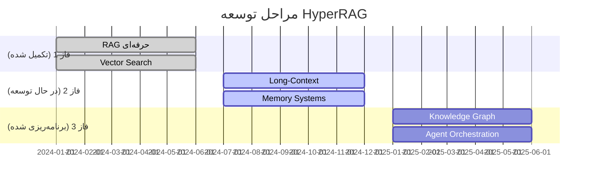

# Neo4j Knowledge Graph Integration

**Last Updated:** 2025-10-25  
**Status:** Planned Feature - Phase 3

---

## چرا Neo4j استفاده نشده است؟

### وضعیت فعلی

در پیاده‌سازی فعلی، سیستم صرفاً مبتنی بر **vector search** با Qdrant است. Neo4j در معماری طراحی شده (Architecture.md) به عنوان بخشی از فاز 3 (Agentic) در نظر گرفته شده اما هنوز پیاده‌سازی نشده است.

### دلایل عدم پیاده‌سازی فعلی

#### 1. **اولویت فازهای توسعه**



**فاز 1 (تکمیل شده):**
- ✅ Vector search با Qdrant
- ✅ Hybrid retrieval (dense + sparse)
- ✅ Multi-language support
- ✅ Basic RAG pipeline

**فاز 2 (در حال توسعه):**
- 🔄 Long-context management
- 🔄 Memory systems
- 🔄 Advanced caching

**فاز 3 (برنامه‌ریزی):**
- ⏳ Knowledge graph (Neo4j)
- ⏳ Agent orchestration با graph reasoning
- ⏳ Complex query reasoning

---

## معماری در نظر گرفته شده برای Neo4j

### نقش Neo4j در معماری

بر اساس **Architecture.md** (خطوط 25، 33)، Neo4j به عنوان `graph.kg.mcp` در معماری در نظر گرفته شده:

```
┌─────────────────────────────────────────┐
│      Agent Orchestrator                  │
└──────────┬───────────────────────────────┘
           │
           ├─── retriever.mcp (Qdrant)
           ├─── pack.longrag.mcp
           ├─── memory.memorag.mcp
           ├─── graph.kg.mcp (Neo4j)  ← اینجا!
           ├─── evaluator.ragas.mcp
           ├─── policy.opa.mcp
           └─── costing.billing.mcp
```

### مزایای استفاده از Neo4j

#### 1. **Structured Knowledge**
```cypher
// نمایش روابط مفهومی
MATCH (c:Concept)-[:RELATED_TO]->(related)
WHERE c.name = "سند"
RETURN related.name, related.type
```

#### 2. **Complex Reasoning**
```cypher
// جستجوی مفهومی با تراوش (Traversal)
MATCH path = (start:Concept)-[:CONNECTED*..3]->(end)
WHERE start.name = "پرسجو" AND end.category = "راه‌حل"
RETURN path
```

#### 3. **Entity Relations**
```cypher
// استخراج entities و روابط
MATCH (e1:Entity)-[r:RELATION]->(e2:Entity)
WHERE r.type IN ["مکمل", "مقابل", "زیرمجموعه"]
RETURN e1, r, e2
```

#### 4. **Semantic Navigation**
```cypher
// جستجوی با واسطه‌ها (Intermediate nodes)
MATCH (start)-[r1]->(intermediate)-[r2]->(end)
WHERE start.name = "موضوع A" AND end.name = "موضوع B"
RETURN intermediate, r1, r2
```

---

## نقش Neo4j در HyperRAG

### سناریوهای استفاده

#### سناریو 1: Graph-Enhanced RAG

```python
# جریان پیشنهادی
1. Query: "راهکار افزایش فروش"
   ↓
2. Vector Search (Qdrant): یافتن chunks مرتبط
   ↓
3. Knowledge Graph (Neo4j): یافتن concepts مرتبط
   ↓
4. Fusion: ترکیب نتایج vector + graph
   ↓
5. Answer Generation
```

#### سناریو 2: Concept Expansion

```cypher
// گسترش query با مفاهیم مرتبط
MATCH (q:Concept {name: "قیمت"})-[:RELATED]->(rel)
RETURN rel.name as related_concept
// Results: "هزینه", "ارزش", "فاکتور", ...
```

#### سناریو 3: Multi-hop Reasoning

```cypher
// استدلال چندمرحله‌ای
MATCH path = (start:Concept)-[*..4]->(end)
WHERE start.name = "کاهش هزینه" 
  AND end.name = "افزایش سود"
RETURN path
```

---

## معماری پیشنهادی

### Service: `graph.kg`

```python
"""
Knowledge Graph Service using Neo4j
Purpose: Provide graph-based knowledge reasoning
"""

class KnowledgeGraphService:
    """Service for Neo4j knowledge graph operations"""
    
    def __init__(self, neo4j_url: str):
        self.driver = GraphDatabase.driver(neo4j_url)
    
    async def query_concepts(
        self, 
        query_text: str,
        lang: str,
        tenant: str
    ) -> List[Concept]:
        """Find related concepts in the graph"""
        cypher = """
        MATCH (c:Concept)-[r:RELATED_TO]->(related)
        WHERE c.tenant = $tenant AND c.lang = $lang
            AND (c.name CONTAINS $query OR c.aliases CONTAINS $query)
        RETURN related.name, related.id, r.weight
        ORDER BY r.weight DESC
        LIMIT 10
        """
        # Execute query...
    
    async def expand_query(
        self,
        base_concepts: List[str],
        lang: str,
        tenant: str
    ) -> List[str]:
        """Expand query with related concepts"""
        cypher = """
        MATCH (c:Concept)-[:RELATED_TO]->(expanded)
        WHERE c.name IN $concepts 
            AND c.tenant = $tenant
            AND expanded.lang = $lang
        RETURN DISTINCT expanded.name
        """
        # Execute query...
    
    async def find_path(
        self,
        start_concept: str,
        end_concept: str,
        max_hops: int = 3
    ) -> List[Dict]:
        """Find path between two concepts"""
        cypher = """
        MATCH path = shortestPath(
            (start:Concept)-[:RELATED_TO*..5]->(end:Concept)
        )
        WHERE start.name = $start 
            AND end.name = $end
        RETURN path
        """
        # Execute query...
```

### API Endpoint

```python
@app.post("/graph/query")
async def query_graph(request: GraphQueryRequest):
    """Query knowledge graph for related concepts"""
    result = await kg_service.query_concepts(
        query_text=request.query,
        lang=request.lang,
        tenant=request.tenant
    )
    return {"concepts": result, "total": len(result)}
```

---

## نحوه استفاده در Retriever

### Hybrid Retrieval با Graph

```python
class EnhancedRetriever:
    """Retriever with both vector and graph search"""
    
    async def retrieve_hybrid(
        self,
        query: str,
        lang: str,
        tenant: str
    ) -> RetrievalResponse:
        # 1. Vector search
        vector_results = await qdrant.search(
            query_vector=embed(query),
            filter=Filter(tenant=tenant, lang=lang)
        )
        
        # 2. Graph search
        graph_results = await neo4j.query_concepts(
            query_text=query,
            lang=lang,
            tenant=tenant
        )
        
        # 3. Fusion
        combined = reciprocal_rank_fusion(
            vector_results, 
            graph_results
        )
        
        return combined
```

---

## مزایای اضافه کردن Neo4j

### 1. **Query Expansion**
```python
# Query اصلی
"قیمت محصول"

# با Neo4j
"قیمت، هزینه، نرخ، قیمت‌گزاری، ارزش محصول"
```

### 2. **Semantic Relationships**
```cypher
// روابط معنایی
(Product)-[:HAS_COST]->(Cost)
(Product)-[:RELATED_TO]->(Service)
(Cost)-[:INCLUDES]->(Pricing)
```

### 3. **Multi-modal Knowledge**
```python
# ترکیب Vector + Graph
vector_score = cosine_similarity(query, doc)
graph_score = relationship_weight(query, doc)
final_score = weighted_avg(vector_score, graph_score)
```

### 4. **Explainable Results**
```python
# توضیح دلایل
"The answer connects 'A' to 'B' through 'C'"
# Neo4j path: A → C → B (weight: 0.85)
```

---

## ملاحظات پیاده‌سازی

### نیازمندی‌ها

1. **نصب Neo4j**:
```bash
# docker-compose.yml
neo4j:
  image: neo4j:5
  ports:
    - "7474:7474"  # HTTP
    - "7687:7687"  # Bolt
  environment:
    - NEO4J_AUTH=neo4j/Adakpro123
```

2. **Service**: `graph.kg`
- Port: TBD
- Language: Python
- Library: `neo4j` driver

3. **Indexing**:
- استخراج entities از متن
- استخراج relationships
- ذخیره در Neo4j

### چالش‌ها

1. **زبان فارسی**: پردازش فارسی در graph
2. **Performance**: ترکیب vector + graph search
3. **Complexity**: مدیریت دو پایگاه داده
4. **Cost**: سرور اضافی برای Neo4j

---

## مقایسه با حالت فعلی

| جنبه | فعلی (فقط Qdrant) | با Neo4j |
|------|-------------------|----------|
| جستجوی معنایی | ✅ عالی | ✅ عالی |
| روابط مفهومی | ❌ ندارد | ✅ دارد |
| Query expansion | ❌ محدود | ✅ گسترده |
| Reasoning | ❌ ندارد | ✅ دارد |
| Explainability | ⚠️ محدود | ✅ عالی |
| پیچیدگی | ✅ ساده | ⚠️ پیچیده‌تر |
| هزینه | ✅ کمتر | ⚠️ بیشتر |

---

## توصیه

### وضعیت فعلی
سیستم فعلی با Qdrant برای اکثر use cases کافی است:
- جستجوی معنایی عالی
- پشتیبانی از فارسی
- Performance خوب
- سادگی پیاده‌سازی

### چه زمانی Neo4j اضافه کنیم؟

Neo4j را در موارد زیر اضافه کنید:

1. **نیاز به استدلال مفهومی**
2. **Query های پیچیده با روابط**
3. **نیاز به query expansion گسترده**
4. **نیاز به explainability بالا**
5. **داده‌های با ساختار گرافی مشخص**

### راهکار مرحله‌ای

```python
# Phase 1 (فعلی): فقط Qdrant
retriever.retrieve(query) → Qdrant

# Phase 2 (آینده): گراف اختیاری
retriever.retrieve(
    query,
    use_graph=True  # optional
) → Qdrant + Neo4j

# Phase 3: گراف هوشمند
retriever.retrieve(query) → 
    if is_conceptual(query):
        return Qdrant + Neo4j
    else:
        return Qdrant
```

---

## نتیجه‌گیری

Neo4j یک قابلیت **عالی** برای فاز 3 است اما برای فاز 1 و 2 ضروری نیست. سیستم فعلی با Qdrant به خوبی کار می‌کند و اضافه کردن Neo4j را می‌توان به عنوان یک **enhancement** در آینده پیاده‌سازی کرد.

---

**خلاصه:**
- ✅ Neo4j در معماری در نظر گرفته شده (Phase 3)
- ✅ مزایای زیادی دارد اما پیچیدگی اضافه می‌کند
- ✅ فعلاً با Qdrant کفایت می‌کند
- ✅ می‌توان به عنوان feature اختیاری اضافه کرد

**مرجع:** Architecture.md خطوط 25، 33 - Neo4j به عنوان `graph.kg.mcp` در معماری در نظر گرفته شده

